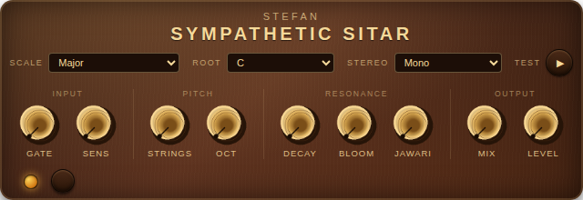

# Sympathetic Sitar

A sympathetic-resonance plugin — **LV2, VST3, and CLAP** — for
[MOD](https://mod.audio) devices (MOD Dwarf, MOD Desktop), desktop DAWs on
Linux / Windows / macOS, and any standard LV2 host. Drives up to 48 tuned
feedback comb-filter strings from the input signal to produce sitar-like
ringing, microtonal accompaniment — the same idea as a real sitar's *taraf*
(sympathetic strings beneath the frets).

**[Install](#install) · [Manual (PDF)](docs/manual/sitar-manual.pdf) · [Releases](https://github.com/stefdoerr/sitar/releases/latest) · [Building & contributing](DEVELOPERS.md)**



## What it does

Send a guitar, synth, voice, or anything else through the plugin. Each
internal "string" is a tuned resonator that rings whenever the input has
energy at (or near) the string's frequency or one of its harmonics. The
result is a shimmering, slowly-decaying halo of pitched overtones that
follow whatever you play, harmonized against the scale you pick. The
48-string bank spans roughly four octaves above the root, and
`STRINGS` cursors over how many of them ring at once.

The [PDF manual](docs/manual/sitar-manual.pdf) walks through every control
with pictures — the fastest way in.

## Install

Every release ships ready-to-run bundles. Grab the latest for your platform from the
**[Releases page](https://github.com/stefdoerr/sitar/releases/latest)** and
follow the matching steps below.

> Replace `X.Y.Z` below with the version you downloaded (e.g. `0.2.0`). The
> plugin always appears under brand **Stefan** as **Sympathetic Sitar**.

### MOD Desktop (Linux)

Download `sitar-vX.Y.Z-linux-amd64.tar.gz`, then copy the `sitar.lv2/` folder
into your MOD Desktop plugin directory (default `~/Documents/MOD Desktop/lv2/`):

```bash
tar xf sitar-vX.Y.Z-linux-amd64.tar.gz
cp -r sitar.lv2 ~/"Documents/MOD Desktop/lv2/"
```

Restart MOD Desktop and the plugin shows up in the plugin store.

### MOD Dwarf (hardware)

Download `sitar-vX.Y.Z-dwarf-aarch64.tar.gz`, copy `sitar.lv2/` onto the device
over the network, and restart its audio stack:

```bash
tar xf sitar-vX.Y.Z-dwarf-aarch64.tar.gz
scp -O -r sitar.lv2 root@192.168.51.1:/root/.lv2/
ssh root@192.168.51.1 'systemctl restart jack2 mod-ui'
```

The plugin then appears in the Dwarf's plugin store.

### Desktop DAWs — VST3 / CLAP (Linux · Windows · macOS)

Download the bundle for your OS and put the plugin in your system plugin folder:

| OS | Download | Copy the `.vst3` / `.clap` into |
|---|---|---|
| **Linux** | `sitar-vX.Y.Z-linux-x86_64.tar.xz` | `~/.vst3/` and `~/.clap/` |
| **Windows** | `sitar-vX.Y.Z-win64.zip` | `%COMMONPROGRAMFILES%\VST3\` and `…\CLAP\` |
| **macOS** | `sitar-vX.Y.Z-macos-universal.pkg` | run the installer |

The macOS package is **unsigned** — right-click it and choose **Open** to get
past Gatekeeper. Rescan plugins in your DAW afterwards.

> **Raspberry Pi / Patchbox OS:** LV2 builds for `rpi-aarch64` and
> `patchbox-os-arm32` are on the Releases page too, and the plugin is published
> on [Patchstorage](https://patchstorage.com/) for one-tap install on supported
> devices.

## Manual

A beginner-friendly **PDF manual** walks through every control, sound recipes,
and installation — no developer knowledge needed. **[Read the
manual](docs/manual/sitar-manual.pdf).** It's bundled in every
[release](https://github.com/stefdoerr/sitar/releases/latest) as
`sitar-manual.pdf`, and on a MOD device it's the *documentation* button in the
plugin's info dialog.

## Building & contributing

Building from source, installing local builds, cross-compiling for the MOD
Dwarf, the release / publishing workflow, and the full control + DSP reference
all live in **[DEVELOPERS.md](DEVELOPERS.md)**.

## License

The plugin source is ISC-licensed. DPF is ISC-licensed (see [`dpf/LICENSE`](dpf/LICENSE)).

The MOD modgui knob sprite at `plugins/Sitar/modgui/knobs/sitar-knob.png`
is generated procedurally (see `generate_knob.py` in that folder) and is
released as CC0 / public domain.

The thumbnail cartoon sitar (`plugins/Sitar/modgui/thumbnail-sitar.png`)
is **not** CC0 — it's from Flaticon and carries the Flaticon free-license
attribution requirement:
[Sitar icons created by Freepik – Flaticon](https://www.flaticon.com/free-icons/sitar).

## Acknowledgements

* [DISTRHO Plugin Framework](https://github.com/DISTRHO/DPF) — the cross-platform LV2/VST/CLAP framework
* [MOD Audio](https://mod.audio) — for the Dwarf, MOD Desktop, mod-plugin-builder, and the modgui design
* Microtonal interval references: [microtonaltheory.com](https://www.microtonaltheory.com/microtonal-ethnography/turkish-makams), [Sethares Akkoc 2014](https://sethares.engr.wisc.edu/paperspdf/MP3204_02_Akkoc.pdf), [narenratan/scale-library](https://github.com/narenratan/scale-library), and Bhatkhande's Just-intonation swara ratios for the Hindustani ragas
